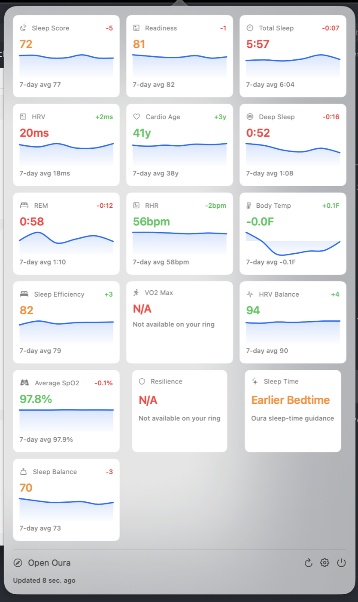

# REM-Bar 🌙 — Oura sleep and recovery in your menu bar.

> Your Oura Ring, without opening the dashboard.

[](https://github.com/psufka/REM-Bar/releases/latest)
[](Package.swift)
[](#mcp-server)
[](LICENSE)



Tiny native macOS 14+ menu-bar app for Oura Ring data. REM-Bar shows sleep, readiness, activity, recovery, SpO2, VO2 max, bedtime guidance, and related trends as configurable menu-bar cards. It also ships a small read-only MCP server so Claude Code, Codex, or any other MCP-capable LLM client can query the same Oura data locally.

## Why

- **Sleep and recovery at a glance.** Pick the menu-bar metric you care about and keep the full card grid one click away.
- **Your cards, your order.** Drag metrics between Active and Inactive sections in Settings, then reorder Active cards to control the popover.
- **Real Oura data only.** REM-Bar uses your Oura Personal Access Token and does not include synthetic or demo data.
- **Local by default.** Tokens live in the macOS Keychain or your existing local Oura config; the bundled MCP server reads the same token sources.
- **Built-in updates.** Starting with v0.1.3, REM-Bar can check for signed app updates from GitHub Releases.

## Install

### Requirements

- macOS 14+ Sonoma
- Oura account with a Personal Access Token

### GitHub Releases

**How to install:** Download `REM-Bar-v0.1.2.zip` [here](https://github.com/psufka/REM-Bar/releases/download/v0.1.2/REM-Bar-v0.1.2.zip), unzip it, and move `REM-Bar.app` to `/Applications`.

The v0.1 release is unsigned and not notarized. If macOS blocks the first launch, run:

```bash
xattr -dr com.apple.quarantine /Applications/REM-Bar.app
open /Applications/REM-Bar.app
```

### First Run

- Open REM-Bar from `/Applications`.
- Open Settings → Account.
- Click **How to set up your token** if you need an Oura token.
- Paste the token and save it to Keychain.
- Open Settings → Display to choose the menu-bar metric, temperature unit, active cards, and card order.

## Token Sources

REM-Bar checks token sources in this order:

1. `OURA_TOKEN` environment variable
2. REM-Bar Keychain item using service `com.psufka.REM-Bar`
3. `~/.oura-mcp/config.json`
4. `launchctl getenv OURA_TOKEN`
5. Common shell and dotenv files such as `~/.zshrc`

Settings → Account shows which source is active. If `OURA_TOKEN` is set, it wins over Keychain until you remove that environment variable.

## MCP Server

REM-Bar bundles `RemBarMCP`, a small stdio JSON-RPC MCP server for Claude Code, Codex, or any other MCP-capable LLM client. It is read-only and uses the same token discovery path as the app.

After moving the app to `/Applications`, install it for Claude Code with:

```bash
claude mcp add rem-bar /Applications/REM-Bar.app/Contents/MacOS/RemBarMCP
```

For Codex or another MCP client, point the client at the same executable path:

```text
/Applications/REM-Bar.app/Contents/MacOS/RemBarMCP
```

The server exposes these tools:

```text
oura_personal_info
oura_daily_sleep
oura_sleep_detail
oura_daily_readiness
oura_daily_activity
oura_daily_stress
oura_daily_resilience
oura_daily_cardiovascular_age
oura_daily_spo2
oura_vo2_max
oura_sleep_time
oura_heart_rate
oura_ring_battery_level
oura_workout
oura_session
oura_rest_mode_period
oura_tag
oura_enhanced_tag
```

## Features

- Native SwiftUI menu-bar app with no Dock icon.
- Configurable menu-bar metric and refresh cadence.
- Twenty-six Oura metric cards with persisted Active/Inactive state and drag ordering.
- Celsius/Fahrenheit display setting for temperature deviation metrics.
- Sleep duration metrics formatted as hours and minutes.
- Categorical cards for Resilience, Optimal Bedtime, Sleep Time Recommendation, and Daily Stress.
- Graceful unavailable states for Gen3+/Membership-gated Oura endpoints.
- Sparkle-powered update checks with a manual Check for Updates button in Settings → About.
- Shared `OuraKit` Swift library used by the app and MCP server.
- Offline tests with Oura fixtures and URLProtocol stubs.

## Privacy Note

REM-Bar does not crawl your disk. It reads a short list of known token locations, stores saved tokens in the macOS Keychain, and calls Oura API v2 with your token. The MCP server is local stdio only; it does not run a network listener.

Some Oura endpoints require a Gen3+ ring and active Membership. When Oura returns an empty, unavailable, or forbidden response for those endpoints, REM-Bar keeps the rest of the dashboard working and marks that card unavailable.

## macOS Permissions

- **Keychain access:** used to save and read your Oura Personal Access Token.
- **Network access:** used only for Oura API calls and the Open Oura link.
- **No Screen Recording or Accessibility permission:** REM-Bar does not need either.

## Build From Source

Requires macOS 14+ and SwiftPM.

```bash
swift build
swift test
./Scripts/compile_and_run.sh
```

Build a local `.app` bundle and release zip:

```bash
./Scripts/package_app.sh
open dist/REM-Bar.app
```

Generate the signed Sparkle appcast for a release zip:

```bash
./Scripts/make_appcast.sh dist/REM-Bar-v0.1.3.zip
```

The Sparkle private key is intentionally not stored in this repo. Release maintainers need it at `~/.rem-bar/sparkle-ed25519-private-key.txt`.

Build a universal app when both macOS architectures are available:

```bash
ARCHES="arm64 x86_64" ./Scripts/package_app.sh
```

## Development

```bash
./Scripts/lint.sh
swift build
swift test
```

`Scripts/lint.sh` runs SwiftFormat and SwiftLint when they are installed, and skips them otherwise.

## Credits

REM-Bar's app structure, settings shape, status item approach, display-link handling, and packaging flow are adapted from [CodexBar](https://github.com/steipete/CodexBar) by Peter Steinberger, used under the MIT License.

The Oura token fallback pattern and serialized 401 retry shape are adapted from [oura-mcp](https://github.com/daveremy/oura-mcp).

## License

MIT • Paul Sufka
