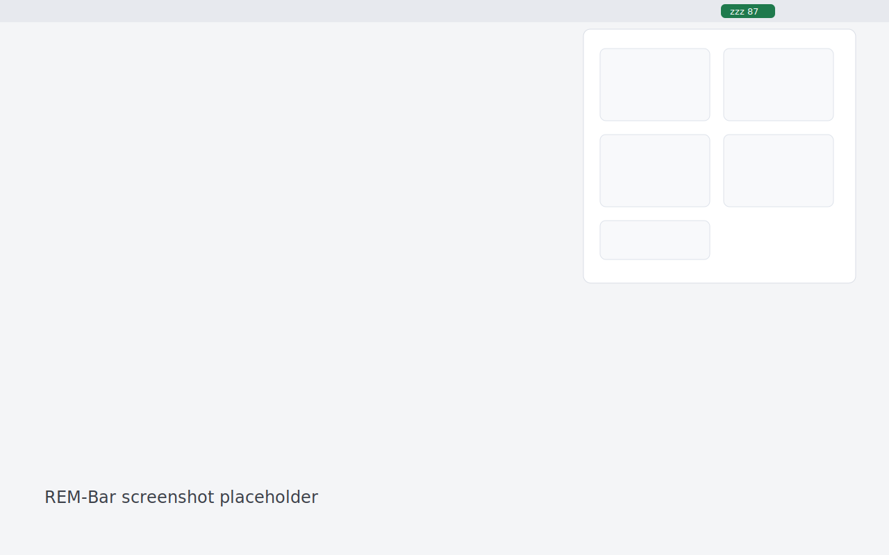

# REM-Bar



REM-Bar is a native macOS menu-bar app for Oura Ring sleep, REM, HRV, resting heart rate, and readiness data.

## Install

Download `REM-Bar-v0.1.0.zip`, unzip it, move `REM-Bar.app` to `/Applications`, then run:

```sh
xattr -dr com.apple.quarantine /Applications/REM-Bar.app
```

## How It Works

REM-Bar stores your Oura Personal Access Token in the macOS Keychain.
The menu-bar item refreshes Oura API v2 on the cadence you choose.
The popover shows five Oura metrics with seven-day context.
The bundled MCP server exposes the same read-only Oura data to Claude Code.

## MCP

```sh
claude mcp add rem-bar /Applications/REM-Bar.app/Contents/MacOS/RemBarMCP
```
